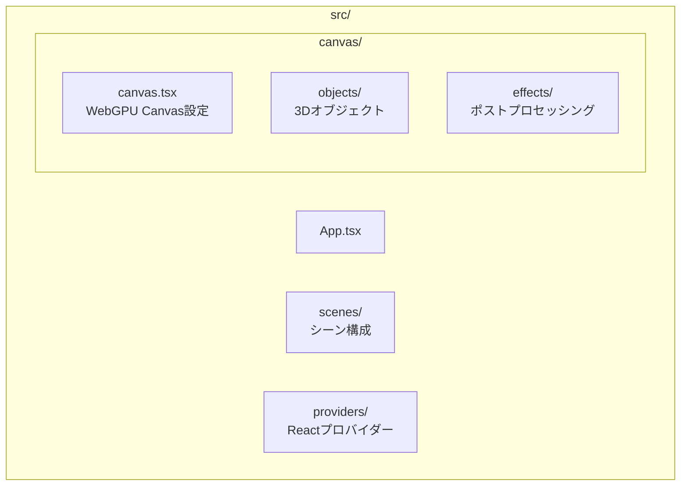
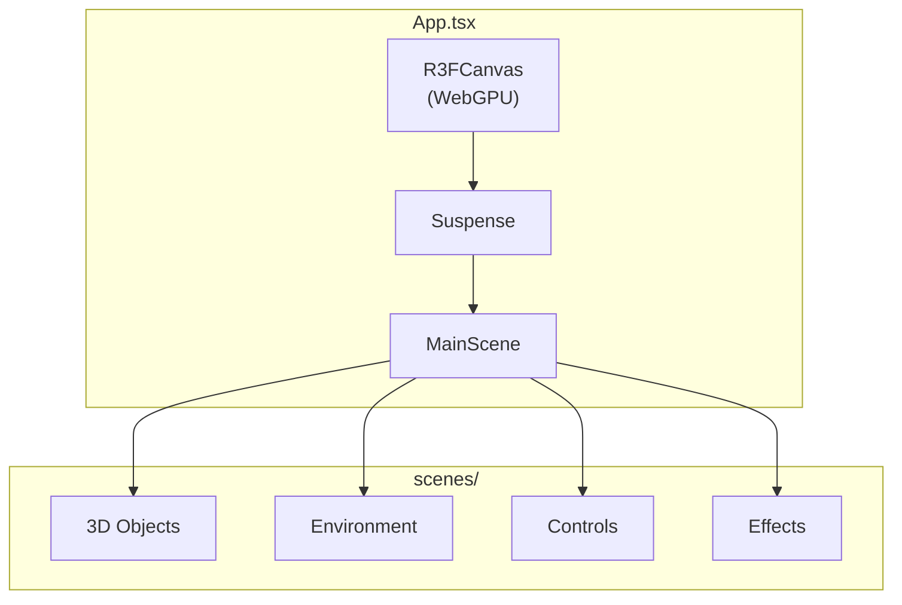
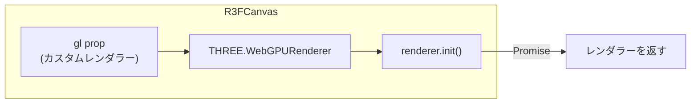
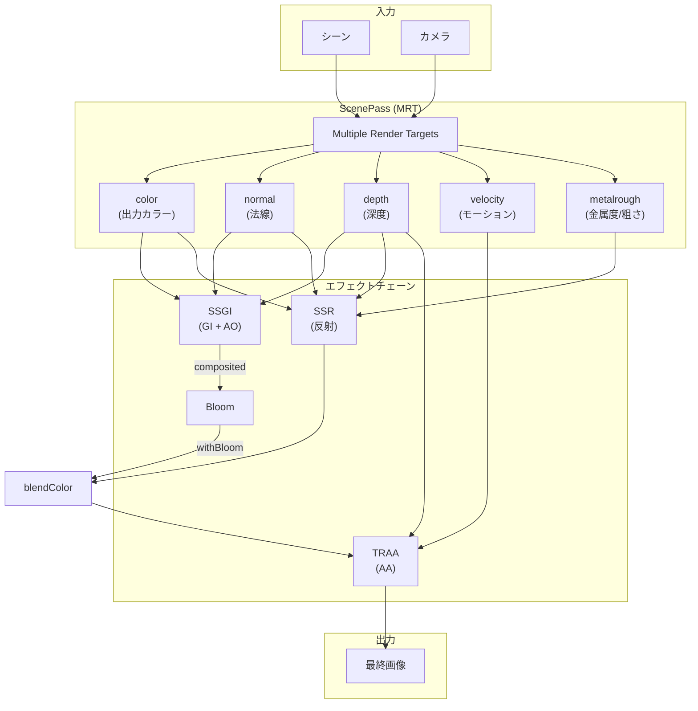
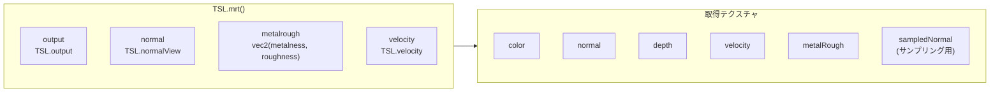
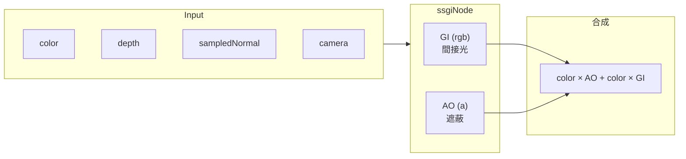
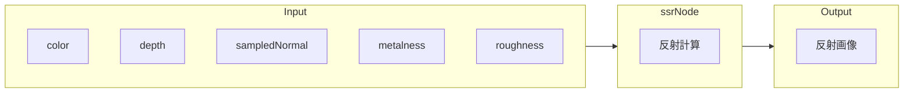
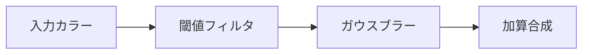
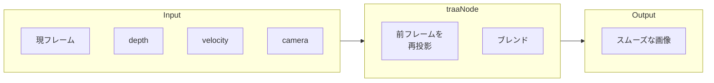
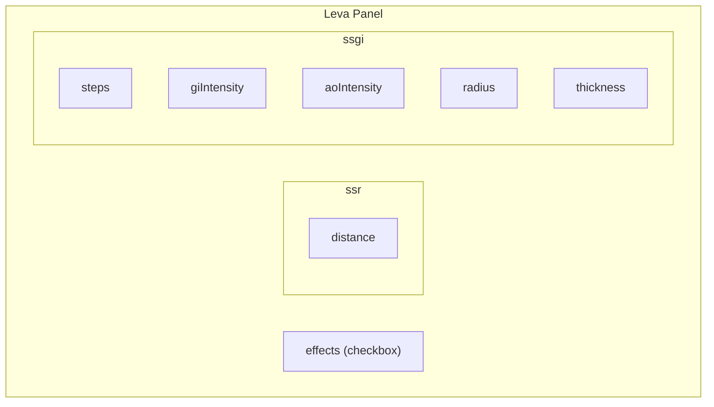

# R3F WebGPU テンプレート アーキテクチャ

このドキュメントでは、React Three Fiber (R3F) + WebGPU + TSL（Three.js Shading Language）を使用したポストプロセッシングテンプレートの構造を説明します。

---

## 📁 フォルダ構成



| フォルダ | 役割 |
|---------|------|
| `canvas/` | R3F Canvas と 3D関連のコード |
| `canvas/objects/` | GLTFモデル、メッシュなどの3Dオブジェクト |
| `canvas/effects/` | ポストプロセッシングエフェクト（SSR, SSGI, Bloom等） |
| `scenes/` | シーン全体の構成（オブジェクト + エフェクト + 環境） |
| `providers/` | React Context プロバイダー |

---

## 🔄 アプリケーションフロー



---

## 🎨 WebGPU レンダラー設定

`canvas/` フォルダで WebGPU レンダラーを初期化します。



**ポイント:**
- `three/webgpu` からインポート
- `antialias: false` → TRAAで後からアンチエイリアス適用
- `renderer.init()` は非同期（Promise）

---

## 🖼️ ポストプロセッシング パイプライン

### 全体フロー



---

## 📦 MRT (Multiple Render Targets)

`effects/` 内の `useScenePass` フックでシーンを一度レンダリングし、複数のテクスチャを同時に出力します。



**用途:**
| テクスチャ | 用途 |
|-----------|------|
| `color` | シーンの描画結果 |
| `normal` | SSR/SSGIの反射・遮蔽計算 |
| `depth` | 深度テスト、レイマーチング |
| `velocity` | TRAAのモーションベクター |
| `metalRough` | SSRの反射強度制御 |

---

## 🌟 各エフェクトの説明

### SSGI (Screen Space Global Illumination)



**パラメータ:**
- `steps`: レイマーチのステップ数
- `radius`: サンプリング半径
- `giIntensity`: 間接光の強度
- `aoIntensity`: アンビエントオクルージョンの強度
- `thickness`: 深度判定の厚み

---

### SSR (Screen Space Reflections)



**パラメータ:**
- `maxDistance`: レイの最大距離
- `thickness`: 深度バッファの厚み判定
- `blurQuality`: 反射のブラー品質

---

### Bloom



**パラメータ:**
- `threshold`: 発光する明るさの閾値
- `strength`: Bloomの強度
- `radius`: ブラーの半径

---

### TRAA (Temporal Reprojection Anti-Aliasing)



**特徴:**
- モーションベクターを使用してゴーストを軽減
- ジッターパターンでサブピクセル精度

---

## 🎛️ Leva コントロール

各エフェクトは `useXXXControls()` フックでLevaパネルを提供します。



---

## 🔧 新しいエフェクトの追加方法

1. `effects/` に新しいファイルを作成

```typescript
// 例: dof.ts (被写界深度)
import { dof as dofNode } from 'three/examples/jsm/tsl/display/DOFNode.js'
import type { ScenePassTextures } from './types'

export function createDOFPass(textures: ScenePassTextures, config: DOFConfig) {
  return dofNode(textures.color, textures.depth, /* ... */)
}

export function useDOFControls() {
  return useControls({ dof: folder({ /* ... */ }) })
}
```

2. メインの `Effects` コンポーネントでパイプラインに組み込む

```typescript
const dofPass = createDOFPass(textures, dofConfig)
const withDOF = TSL.blendColor(composited, dofPass)
```

3. `index.ts` でエクスポート

---

## 📚 参考リンク

- [Three.js WebGPU Examples](https://threejs.org/examples/?q=webgpu)
- [TSL (Three.js Shading Language)](https://github.com/mrdoob/three.js/wiki/Three.js-Shading-Language)
- [React Three Fiber Docs](https://docs.pmnd.rs/react-three-fiber)
- [Leva Controls](https://github.com/pmndrs/leva)

---

## 💡 Tips

### TSLの基本

```typescript
import * as TSL from 'three/tsl'

// ノード作成
const color = TSL.vec4(1, 0, 0, 1)  // 赤色
const uv = TSL.uv()                  // UV座標

// 演算
const result = color.mul(0.5)        // 乗算
const added = color.add(other)       // 加算

// サンプリング
const sampled = texture.sample(uv)
```

### デバッグ

特定のテクスチャを直接表示してデバッグ:

```typescript
// 法線を表示
postProcessing.outputNode = textures.normal

// 深度を表示
postProcessing.outputNode = textures.depth
```

