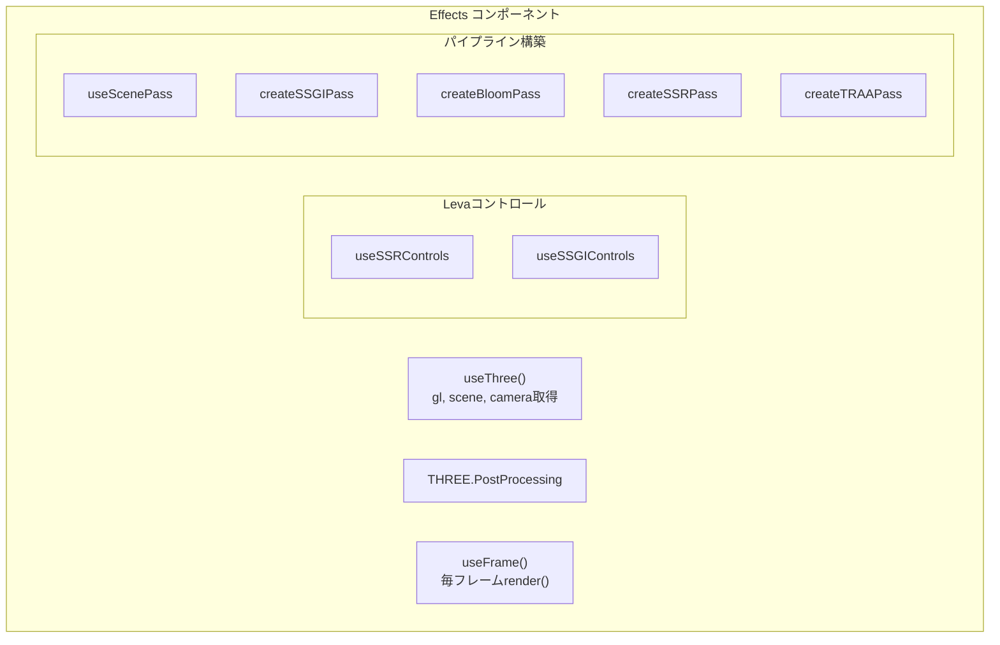
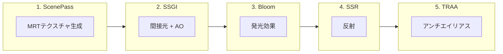

# Effects

全てのポストプロセッシングエフェクトを統合し、レンダリングパイプラインを構築するメインコンポーネント。

---

## 概要

`Effects` コンポーネントは各エフェクトを**チェーン状に接続**し、最終的な画像を生成します。R3Fのシーン内に配置して使用します。



---

## パイプラインの流れ



### 詳細な合成フロー

```typescript
// 1. SSGI - GI + AOを合成
const ssgiResult = createSSGIPass(textures, camera, ssgiConfig)

// 2. Bloom - SSGIの結果にBloomを追加
const bloomPass = createBloomPass(ssgiResult.composited)
const withBloom = ssgiResult.composited.add(bloomPass)

// 3. SSR - 反射をブレンド
const ssrPass = createSSRPass(textures, ssrConfig)
const composited = TSL.blendColor(withBloom, ssrPass)

// 4. TRAA - 最後にアンチエイリアス
const finalPass = createTRAAPass(composited, textures, camera)

// 出力ノードに設定
postProcessing.outputNode = finalPass
```

---

## 使用方法

```tsx
import { Effects } from './canvas/effects'

function MainScene() {
  return (
    <>
      {/* 3Dオブジェクト */}
      <mesh>...</mesh>
      
      {/* エフェクト（シーン内に配置） */}
      <Effects />
    </>
  )
}
```

---

## Levaコントロール

右上に表示されるUIパネルでリアルタイムに調整可能です。

| コントロール | 説明 |
|-------------|------|
| `effects` | エフェクト全体のON/OFF |
| `ssr.distance` | SSRのレイ距離 |
| `ssgi.steps` | SSGIのステップ数 |
| `ssgi.giIntensity` | 間接光の強度 |
| `ssgi.aoIntensity` | AOの強度 |
| `ssgi.radius` | サンプリング半径 |
| `ssgi.thickness` | 深度判定の厚み |

---

## THREE.PostProcessing

WebGPU専用のポストプロセッシングクラスです。

```typescript
const [postProcessing] = useState(
  () => new THREE.PostProcessing(gl as unknown as THREE.WebGPURenderer)
)

// パイプラインを設定
postProcessing.outputNode = finalPass
postProcessing.needsUpdate = true

// 毎フレームレンダリング
useFrame(() => postProcessing.render())
```

---

## レンダリングの優先度

```typescript
useFrame(() => effects && postProcessing.render(), effects ? 1 : 0)
```

第2引数の `1` は優先度です。R3Fのデフォルトレンダリング（優先度0）の**後**に実行されます。

| 優先度 | タイミング |
|--------|-----------|
| 負の値 | デフォルトより前 |
| 0 | デフォルト |
| 正の値 | デフォルトより後 |

---

## 依存関係の管理

`useLayoutEffect` の依存配列でパイプラインの再構築をトリガーします。

```typescript
useLayoutEffect(() => {
  // パイプライン構築...
}, [textures, camera, ssrConfig, ssgiConfig, postProcessing])
```

コントロールの値が変わると自動的にパイプラインが再構築されます。

---

## 新しいエフェクトの追加

1. 新しいパス生成関数を作成
2. `Effects.tsx` のパイプラインに組み込む

```typescript
// 例: DOF (被写界深度) を追加
import { createDOFPass, useDOFControls } from './dof'

// コントロール追加
const dofConfig = useDOFControls()

// パイプラインに挿入
const dofPass = createDOFPass(textures, camera, dofConfig)
const withDOF = /* SSRの後、TRAAの前に挿入 */
```

---

## 参考リンク

- [Three.js PostProcessing ソースコード](https://github.com/mrdoob/three.js/blob/dev/src/renderers/common/PostProcessing.js)
- [Three.js WebGPU PostProcessing Examples](https://threejs.org/examples/?q=webgpu#webgpu_postprocessing)
- [React Three Fiber useFrame](https://docs.pmnd.rs/react-three-fiber/api/hooks#useframe)

---

## デバッグ Tips

特定のテクスチャを直接表示してデバッグできます。

```typescript
// 法線を表示
postProcessing.outputNode = textures.normal

// 深度を表示
postProcessing.outputNode = textures.depth

// SSGIのGI成分のみ表示
postProcessing.outputNode = ssgiResult.gi

// SSGIのAO成分のみ表示  
postProcessing.outputNode = ssgiResult.ao
```

