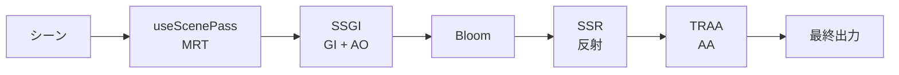

# Effects ドキュメント

このフォルダには各ポストプロセッシングエフェクトの詳細なドキュメントが含まれています。

---

## ドキュメント一覧

| ファイル | 説明 |
|---------|------|
| [Effects.md](./Effects.md) | メイン統合コンポーネント |
| [useScenePass.md](./useScenePass.md) | MRTテクスチャ生成フック |
| [ssgi.md](./ssgi.md) | Screen Space Global Illumination |
| [ssr.md](./ssr.md) | Screen Space Reflections |
| [bloom.md](./bloom.md) | 発光エフェクト |
| [traa.md](./traa.md) | Temporal Anti-Aliasing |

---

## パイプライン概要

---

## クイックリファレンス

### エフェクトの役割

| エフェクト | 役割 | パフォーマンス影響 |
|-----------|------|------------------|
| **SSGI** | 間接光と環境遮蔽 | 高 |
| **SSR** | リアルタイム反射 | 中 |
| **Bloom** | 発光・グロー | 低 |
| **TRAA** | アンチエイリアス | 低 |

### 必要な入力テクスチャ

| エフェクト | color | depth | normal | velocity | metalRough |
|-----------|:-----:|:-----:|:------:|:--------:|:----------:|
| SSGI | ✅ | ✅ | ✅ | - | - |
| SSR | ✅ | ✅ | ✅ | - | ✅ |
| Bloom | ✅ | - | - | - | - |
| TRAA | ✅ | ✅ | - | ✅ | - |

---

## 参考リンク集

### Three.js 公式
- [Three.js WebGPU Examples](https://threejs.org/examples/?q=webgpu)
- [TSL (Three.js Shading Language)](https://github.com/mrdoob/three.js/wiki/Three.js-Shading-Language)

### 技術解説
- [Learn OpenGL - Advanced Lighting](https://learnopengl.com/Advanced-Lighting/Bloom)
- [Real-Time Rendering Resources](https://www.realtimerendering.com/)

### React Three Fiber
- [R3F Documentation](https://docs.pmnd.rs/react-three-fiber)
- [Drei (ヘルパーライブラリ)](https://github.com/pmndrs/drei)

