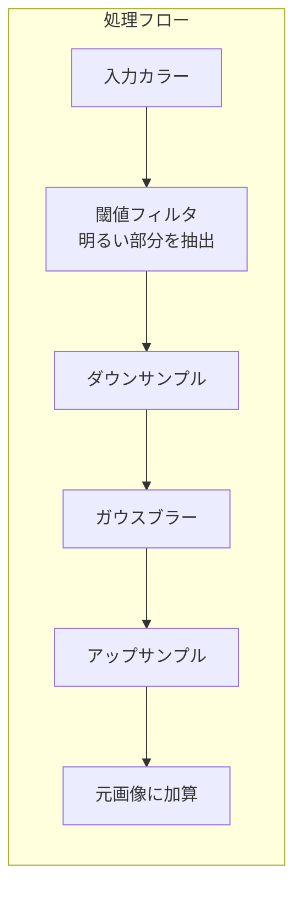

# Bloom

明るい部分を光らせて「グロー」効果を追加するポストプロセッシングエフェクト。

---

## 概要

Bloom は**明るいピクセルを周囲に拡散**させ、光が溢れ出すような効果を作ります。ネオンサイン、太陽光、発光マテリアルなどの表現に最適です。



---

## 仕組み

1. **閾値フィルタ**: 指定した明るさ以上のピクセルのみを抽出
2. **ダウンサンプル**: 解像度を下げてブラーを効率化
3. **ガウスブラー**: 抽出した明るい部分をぼかす
4. **アップサンプル**: 元の解像度に戻す
5. **加算合成**: 元の画像にブラー結果を加算

---

## パラメータ

| パラメータ | 説明 | デフォルト |
|-----------|------|-----------|
| `threshold` | Bloomを適用する明るさの閾値（0-1） | `0.1` |
| `strength` | Bloom効果の強度 | `0.8` |
| `radius` | ブラーの半径（広がり具合） | `0.9` |

### パラメータの効果

```
threshold が低い → より多くのピクセルが光る
threshold が高い → 非常に明るい部分だけ光る

strength が高い → 強烈な発光
radius が大きい → 広範囲にぼける
```

---

## 使用例

```typescript
import { createBloomPass } from './bloom'

// デフォルト設定でBloomを作成
const bloomPass = createBloomPass(sceneColor)

// カスタム設定
const bloomPass = createBloomPass(sceneColor, {
  threshold: 0.5,  // 明るい部分のみ
  strength: 1.2,   // 強めの発光
  radius: 0.8      // 程よいブラー
})

// 元の画像に加算
const withBloom = sceneColor.add(bloomPass)
```

---

## HDR と Bloom

Bloom は **HDR (High Dynamic Range)** レンダリングと相性が良いです。


---

## 参考リンク

- [Three.js BloomNode ソースコード](https://github.com/mrdoob/three.js/blob/dev/examples/jsm/tsl/display/BloomNode.js)
- [Three.js Bloom Example](https://threejs.org/examples/?q=bloom#webgl_postprocessing_unreal_bloom)
- [Bloom (Learn OpenGL)](https://learnopengl.com/Advanced-Lighting/Bloom)
- [Unreal Bloom Implementation](https://docs.unrealengine.com/5.0/en-US/bloom-in-unreal-engine/)
- [Kawase Blur (高速ブラー手法)](https://software.intel.com/content/www/us/en/develop/blogs/an-investigation-of-fast-real-time-gpu-based-image-blur-algorithms.html)

---

## Tips

### Emissive マテリアルとの組み合わせ

```typescript
// 発光マテリアル
<meshStandardMaterial 
  emissive="orange" 
  emissiveIntensity={2} 
/>
```

Emissiveの値が `threshold` を超えると Bloom が適用されます。

### パフォーマンス

Bloom は比較的**軽量**なエフェクトです。`radius` を大きくしすぎるとブラーパスが増えて負荷が上がります。

