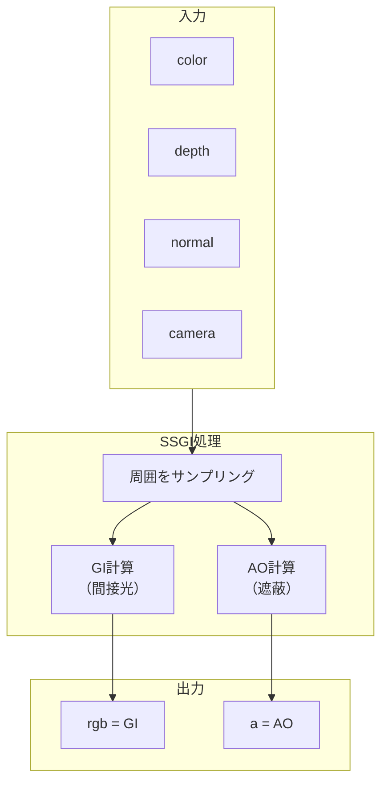
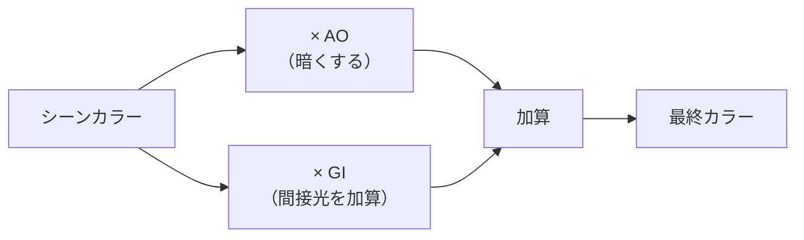

# SSGI (Screen Space Global Illumination)

スクリーン空間でグローバルイルミネーション（間接光）とアンビエントオクルージョン（環境遮蔽）を計算するエフェクト。

---

## 概要

SSGI は**リアルタイムで間接光を近似**する技術です。光が物体に当たって跳ね返り、周囲を照らす効果（カラーブリーディング）を表現します。



---

## GI と AO の違い

### Global Illumination (GI)
- 周囲の物体からの**反射光**を計算
- 赤い壁の近くが赤く染まる（カラーブリーディング）
- シーンに**暖かみ**や**現実感**を追加

### Ambient Occlusion (AO)
- 光が届きにくい**隅や隙間を暗く**する
- コントラストと**奥行き感**を強調
- 出力の**アルファチャンネル**に格納

---

## 合成式

```
finalColor = sceneColor × AO + sceneColor × GI
```



---

## パラメータ

| パラメータ | 説明 | デフォルト |
|-----------|------|-----------|
| `steps` | レイマーチのステップ数。多いほど精度↑、負荷↑ | `8` |
| `radius` | サンプリング半径。大きいほど広範囲の影響を計算 | `15` |
| `giIntensity` | 間接光の強度 | `20` |
| `aoIntensity` | アンビエントオクルージョンの強度 | `4` |
| `thickness` | 深度判定の厚み | `10` |
| `sliceCount` | サンプリングスライス数 | `2` |

---

## 使用例

```typescript
import { createSSGIPass, useSSGIControls } from './ssgi'

// コントロールを取得
const ssgiConfig = useSSGIControls()

// パスを生成
const ssgiResult = createSSGIPass(textures, camera, ssgiConfig)

// 戻り値の構造
// ssgiResult.composited - GI + AO 合成済みカラー
// ssgiResult.gi         - GI成分のみ
// ssgiResult.ao         - AO成分のみ
```

---

## パフォーマンス調整

| 設定 | 低負荷 | 高品質 |
|-----|--------|--------|
| `steps` | 4 | 16+ |
| `radius` | 5 | 30+ |
| `sliceCount` | 1 | 4 |

---

## 参考リンク

- [Three.js SSGINode ソースコード](https://github.com/mrdoob/three.js/blob/dev/examples/jsm/tsl/display/SSGINode.js)
- [Three.js WebGPU SSGI Example](https://threejs.org/examples/?q=webgpu#webgpu_postprocessing_ssgi)
- [Screen Space Global Illumination (N8Programs)](https://github.com/N8python/ssgi)
- [GTAO: Ground Truth Ambient Occlusion](https://www.activision.com/cdn/research/s2016_pbs_activision_occlusion.pdf)
- [Practical Real-Time Strategies for Accurate Indirect Occlusion (SIGGRAPH)](https://blog.selfshadow.com/publications/s2016-shading-course/)

---

## 関連エフェクト

- **SSR**: SSGIと併用して反射も追加
- **Bloom**: GIで明るくなった部分にBloomを適用すると効果的

