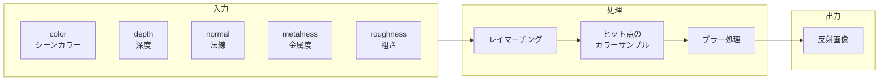

# SSR (Screen Space Reflections)

スクリーン空間でリアルタイムに反射を計算するポストプロセッシングエフェクト。

---

## 概要

SSR（Screen Space Reflections）は、レイトレーシングを使わずに**画面上の情報だけ**で反射を近似する技術です。床や金属面などの反射表現に使用されます。



---

## 仕組み

1. **レイマーチング**: 各ピクセルから反射方向にレイを飛ばす
2. **深度バッファ比較**: レイが深度バッファと交差する点を探す
3. **カラーサンプリング**: 交差点のシーンカラーを取得
4. **ブレンド**: `metalness` と `roughness` に基づいて反射強度を調整

### 制限事項

- **画面外の情報は反射できない**（カメラに映っていないものは見えない）
- **背面は反射しない**（裏側の情報がない）
- 複雑なジオメトリでは**アーティファクト**が発生する可能性

---

## パラメータ

| パラメータ | 説明 | デフォルト |
|-----------|------|-----------|
| `maxDistance` | レイの最大距離。大きいほど遠くの反射を計算 | `11` |
| `thickness` | 深度バッファの厚み判定。薄いオブジェクトの反射精度に影響 | `0.15` |
| `blurQuality` | 反射のブラー品質（粗い表面のぼかし） | `1` |
| `resolutionScale` | 計算解像度のスケール（パフォーマンス調整） | `1` |

---

## 使用例

```typescript
import { createSSRPass, useSSRControls } from './ssr'

// コントロールを取得
const ssrConfig = useSSRControls()

// パスを生成
const ssrPass = createSSRPass(textures, ssrConfig)

// 他のパスとブレンド
const composited = TSL.blendColor(sceneColor, ssrPass)
```

---

## 参考リンク

- [Three.js SSRNode ソースコード](https://github.com/mrdoob/three.js/blob/dev/examples/jsm/tsl/display/SSRNode.js)
- [Three.js WebGPU SSR Example](https://threejs.org/examples/?q=webgpu#webgpu_postprocessing_ssr)
- [Screen Space Reflections - Learn OpenGL](https://learnopengl.com/Advanced-Lighting/SSR)
- [Efficient GPU Screen-Space Ray Tracing (Morgan McGuire)](https://jcgt.org/published/0003/04/04/)
- [Stochastic Screen-Space Reflections (NVIDIA)](https://developer.nvidia.com/sites/default/files/akamai/gameworks/events/gdc14-ssr-notes.pdf)

---

## 関連エフェクト

- **SSGI**: SSRと同様にスクリーン空間で計算（間接光）
- **Bloom**: SSRの結果にBloomを適用すると反射がより華やかに

