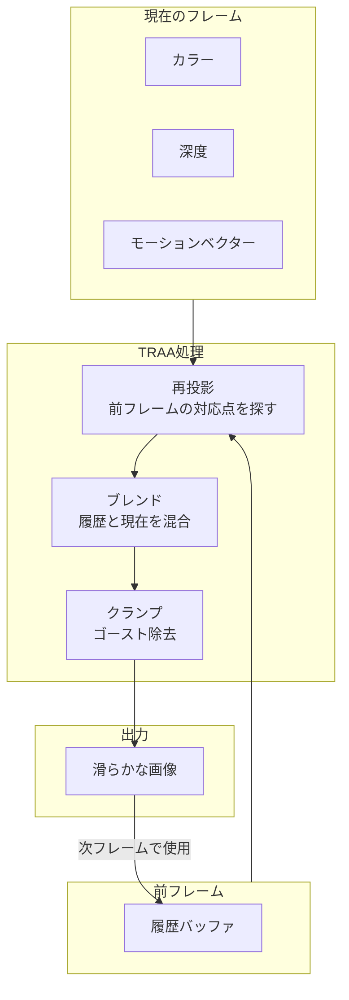
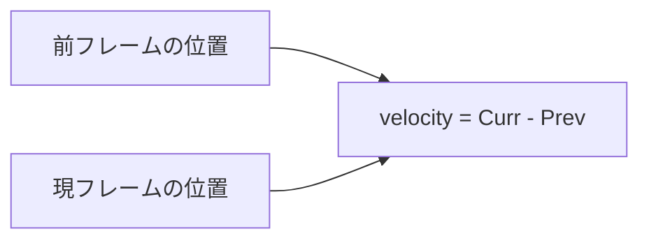
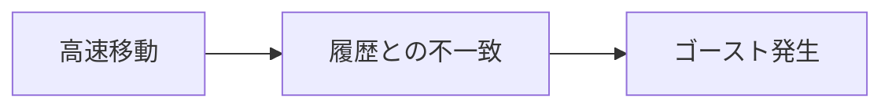

# TRAA (Temporal Reprojection Anti-Aliasing)

時間的な情報を使ってジャギー（エイリアシング）を除去するアンチエイリアシング技術。

---

## 概要

TRAA は**前フレームの情報を再利用**してエッジを滑らかにします。従来のMSAAより軽量で、ポストプロセッシングとの相性が良いのが特徴です。



---

## 仕組み

### 1. ジッタリング
カメラをサブピクセル単位でわずかにずらし、毎フレーム異なる位置からサンプリング

### 2. 再投影 (Reprojection)
モーションベクターを使って、前フレームの対応するピクセルを特定

### 3. ブレンド
現在のフレームと履歴を混合（通常 90%履歴 + 10%現在）

### 4. ゴースト除去
急激な変化があった場合、履歴を棄却して現在のフレームを優先

---

## 必要な入力

| 入力 | 説明 |
|-----|------|
| `color` | 現在フレームのカラー |
| `depth` | 深度バッファ |
| `velocity` | モーションベクター（ピクセルの移動量） |
| `camera` | カメラ（投影行列の計算用） |

### モーションベクター



MRTで `TSL.velocity` として出力されます。

---

## 使用例

```typescript
import { createTRAAPass } from './traa'

// パイプラインの最後に適用
const traaPass = createTRAAPass(compositeColor, textures, camera)

postProcessing.outputNode = traaPass
```

---

## TAA vs TRAA vs FXAA vs MSAA

| 手法 | 品質 | 負荷 | 特徴 |
|-----|------|------|------|
| **MSAA** | 高 | 高 | ジオメトリエッジのみ、ポストエフェクト前に適用 |
| **FXAA** | 低 | 低 | エッジ検出ベース、ぼやけやすい |
| **TAA** | 高 | 中 | 時間的蓄積、ゴースト発生の可能性 |
| **TRAA** | 高 | 中 | TAA改良版、ゴースト軽減 |

---

## ゴースト問題と対策

### ゴーストとは
高速移動時に残像が発生する現象



### 対策
- **モーションベクター**で正確に再投影
- **ネイバーフッドクランプ**で異常値を除去
- **遮蔽チェック**で隠れた領域を検出

---

## 参考リンク

- [Three.js TRAANode ソースコード](https://github.com/mrdoob/three.js/blob/dev/examples/jsm/tsl/display/TRAANode.js)
- [Three.js WebGPU TRAA Example](https://threejs.org/examples/?q=webgpu#webgpu_tsl_earth)
- [Temporal Reprojection Anti-Aliasing (NVIDIA)](https://developer.nvidia.com/temporally-stable-anti-aliasing-and-upscaling)
- [High-Quality Temporal Supersampling (Brian Karis, Epic)](https://de45xmedrsdbp.cloudfront.net/Resources/files/TemporalAA_small-59732822.pdf)
- [A Survey of Temporal Antialiasing Techniques (Lei Yang)](http://behindthepixels.io/assets/files/TemporalAA.pdf)

---

## 注意点

### Canvas設定

TRAAを使う場合、レンダラーの `antialias` は **false** にします（二重にAAをかけない）。

```typescript
const renderer = new THREE.WebGPURenderer({ antialias: false })
```

### パイプラインの位置

TRAAは**パイプラインの最後**に適用します。すべてのエフェクト適用後にアンチエイリアスをかけることで、全体が滑らかになります。

