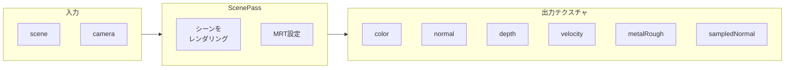
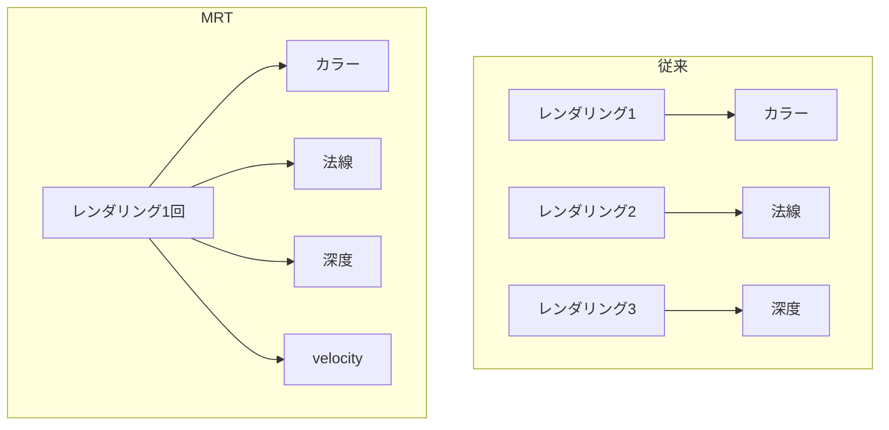

# useScenePass

シーンをレンダリングし、MRT（Multiple Render Targets）で複数のテクスチャを同時に出力するReactフック。

---

## 概要

`useScenePass` は**ポストプロセッシングの基盤**となるフックです。シーンを一度レンダリングするだけで、カラー・深度・法線・モーションベクターなど複数の情報を取得できます。



---

## MRT (Multiple Render Targets) とは

通常のレンダリングは1つの出力（カラー）のみですが、MRTを使うと**1回のレンダリングで複数のテクスチャに出力**できます。



**メリット**: パフォーマンス向上（シーンを1回だけ描画）

---

## 出力テクスチャ

| テクスチャ | 内容 | 用途 |
|-----------|------|------|
| `color` | シーンの描画結果 | Bloom, 最終出力 |
| `normal` | ワールド空間法線（カラーエンコード） | SSR, SSGI |
| `depth` | 深度バッファ | SSR, SSGI, TRAA |
| `velocity` | ピクセルの移動ベクトル | TRAA |
| `metalRough` | vec2(metalness, roughness) | SSR |
| `sampledNormal` | サンプリング可能な法線 | SSR, SSGI |

---

## TSL MRT 設定

```typescript
scenePass.setMRT(
  TSL.mrt({
    output: TSL.output,                              // カラー
    normal: TSL.directionToColor(TSL.normalView),   // 法線 → カラー変換
    metalrough: TSL.vec2(TSL.metalness, TSL.roughness),
    velocity: TSL.velocity                           // モーションベクター
  })
)
```

### TSL ビルトイン変数

| 変数 | 説明 |
|-----|------|
| `TSL.output` | マテリアルの最終出力カラー |
| `TSL.normalView` | ビュー空間の法線 |
| `TSL.metalness` | マテリアルの金属度 |
| `TSL.roughness` | マテリアルの粗さ |
| `TSL.velocity` | ピクセルのモーションベクター |

---

## 使用例

```typescript
import { useScenePass } from './useScenePass'
import { useThree } from '@react-three/fiber'

function Effects() {
  const { scene, camera } = useThree()
  
  // ScenePassとテクスチャを取得
  const { scenePass, textures } = useScenePass(scene, camera)
  
  // 各テクスチャを使用
  const ssrPass = createSSRPass(textures, config)
  const ssgiPass = createSSGIPass(textures, camera, config)
  // ...
}
```

---

## フィルタ設定

```typescript
const scenePass = TSL.pass(scene, camera, { 
  minFilter: THREE.NearestFilter, 
  magFilter: THREE.NearestFilter 
})
```

| フィルタ | 説明 |
|---------|------|
| `NearestFilter` | 補間なし（シャープ、ポストエフェクト向け） |
| `LinearFilter` | 線形補間（滑らか） |

ポストプロセッシングでは通常 `NearestFilter` を使用します。

---

## sampledNormal について

`sampledNormal` は法線をUV座標でサンプリングできる特殊なノードです。

```typescript
// UV座標を受け取り、その位置の法線を返す
sampledNormal: TSL.sample((uv: Node) => 
  TSL.colorToDirection(scenePass.getTextureNode('normal').sample(uv))
)
```

SSRやSSGIのレイマーチングで、任意の位置の法線を取得するために必要です。

---

## 参考リンク

- [Three.js PassNode ソースコード](https://github.com/mrdoob/three.js/blob/dev/src/nodes/display/PassNode.js)
- [Three.js TSL Documentation](https://github.com/mrdoob/three.js/wiki/Three.js-Shading-Language)
- [WebGPU MRT Example](https://threejs.org/examples/?q=webgpu#webgpu_mrt)
- [Deferred Rendering (MRTの代表的な用途)](https://learnopengl.com/Advanced-Lighting/Deferred-Shading)

---

## メモ化について

`useMemo` で結果をメモ化しています。`scene` と `camera` が変わらない限り、同じScenePassインスタンスを再利用します。

```typescript
return useMemo(() => {
  // ScenePass生成...
}, [scene, camera])
```

